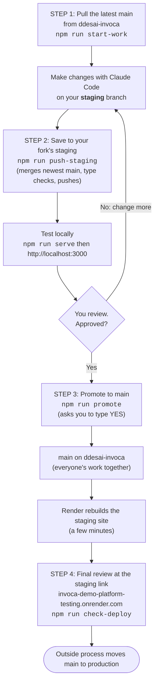

# Team workflow: from an idea to `main`

**Where things live**

| | What it is | Address |
|---|---|---|
| **Team repo** (final) | `ddesai-invoca/invoca-demo-platform-testing`, branch `main`. The git remote called `origin`. Everyone's work comes together here. | https://github.com/ddesai-invoca/invoca-demo-platform-testing |
| **Your fork** | `bmccarty322/invoca-demo-platform-testing`, branch `staging`. The git remote called `fork`. Your own place to build and test. | https://github.com/bmccarty322/invoca-demo-platform-testing/tree/staging |
| **Staging site** | Render builds this from the team repo's `main`. The final check before production. | https://invoca-demo-platform-testing.onrender.com/ |
| **Local test** | The real server on your Mac, from your `staging` branch. | http://localhost:3000 (after `npm run serve`) |

`main` is the team's **staging area**. Moving `main` to production is done by a separate, outside
process and is not covered here. There is one approver: you approve your own work before it goes to `main`.

## The flow



Plain-text version:

```
 ddesai-invoca main ──> your staging branch ──> push to your fork ──> test locally ──> YOU approve ──> ddesai-invoca main ──> staging site ──> production (outside)
      (step 1)              (work here)            (step 2)                              (step 3)          (everyone's work)     (step 4)
```

## Step by step

### Step 1: pull the latest `main`
```bash
cd /Users/bmccarty/invoca-demo-platform-testing
npm run start-work
```
Brings the newest `main` from the team repo into your `staging` branch (creating the branch the first
time). It stops if you have uncommitted changes, so nothing gets mixed up. Do this at the start of
every piece of work.

### Step 2: build and test on `staging`
Make your changes with Claude Code, commit them, then save them to your fork:
```bash
git add -A && git commit -m "Say what changed and why"
npm run push-staging
npm run serve        # then open http://localhost:3000
```
`push-staging` first merges the newest `main` into `staging`, so you never test out-of-date code.
If it reports merge conflicts, resolve the files it lists (Claude Code can help), commit, and run it again.

`npm run dev` (port 5173) is the internal app only. Customer pages (`/d/<slug>`) need `npm run serve`.
Email does not send from your Mac; callbacks still land in the Inbox.

⚠️ `staging` is one branch, so keep **one piece of work in it at a time**. Two unfinished features
in `staging` would be promoted together.

### Step 3: approve, then promote to `main`
When you have reviewed it and approved it:
```bash
npm run promote
```
It checks the code builds, lists exactly which commits are about to go to `main`, and asks you to type
`YES`. Anything else cancels and pushes nothing. If `main` moved while you were working it refuses and
tells you to run `npm run push-staging`, test again, then promote.

### Step 4: final review on the staging site
Render rebuilds from `main` (a few minutes):
```bash
npm run check-deploy
```
It compares the commit the staging site is running with yours. Then use
https://invoca-demo-platform-testing.onrender.com/ for the final review. You can also open
`/api/status` there and read `commitShort`.

### If something is wrong on `main`
Undo the change, then fix it on `staging`. On GitHub, open the merge or commit and use **Revert** (it
makes a new commit that undoes it), or ask Claude Code to `git revert` it and push. Reverting is
quicker and safer than fixing forward on the shared branch.

## Rules that keep `main` healthy
- **Never push straight to `main` from anywhere except `npm run promote`.**
- **Do not commit test demos.** Creating a demo on your Mac can write a file into `src/data/generated/`.
  Those files are bundled for everyone. Leave your test ones untracked and read `git status` before `git add -A`.
- **Run the checks that match what you touched.** `npm run typecheck` always; `npm run audit:share`,
  `audit:customer`, `audit:support` for the customer demo; `npm run audit` for everything.
- **No secrets in commits.** Keys live in `.env` (git-ignored) and in Render's environment settings.
- **Where conflicts usually happen:** the `audit` line in `package.json`, the plugin list in
  `vite.config.ts`, and the end of `src/styles/app.css`. These are lists several people add to; keep both sides.

## One-time setup on your Mac
- Git name and email: `git config --global user.name "Your Name"` and `git config --global user.email "you@invoca.com"`.
- Two remotes: `origin` is the team repo and `fork` is your fork. Check with `git remote -v`.
- A GitHub login git can use: run `git push` once and enter your username and a **personal access token**
  (classic, `repo` scope) as the password. macOS Keychain remembers it.
- **Write** access to `ddesai-invoca/invoca-demo-platform-testing` (a collaborator invite).

## Commands at a glance
| Command | What it does |
|---|---|
| `npm run start-work` | Step 1. Pull the latest `main` into your `staging` branch |
| `npm run push-staging` | Step 2. Merge newest `main`, type check, push to your fork's `staging` |
| `npm run serve` | Build and run the full app at http://localhost:3000 |
| `npm run promote` | Step 3. After you approve: push `staging` into `main` (asks for YES) |
| `npm run check-deploy` | Step 4. Is the staging site running my latest commit? |
